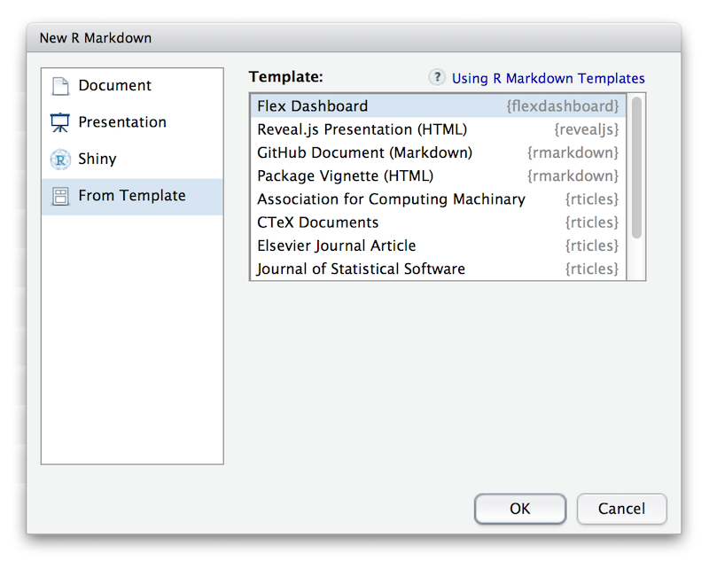

```{r setup, include=FALSE, echo = FALSE}
knitr::opts_chunk$set(echo = TRUE)
library(tidyverse)
library(palmerpenguins)
```

# Intro {#intro}

+---------------------+-----------------------------------------------------------------------------------------------------------------------------------------------+---------+
| Platform            | Download                                                                                                                                      | Size    |
+=====================+===============================================================================================================================================+=========+
| Windows 10/8/7      | [RStudio-1.4.894.exe](https://s3.amazonaws.com/rstudio-ide-build/desktop/windows/RStudio-1.4.894.exe "Windows Download")                      | 157M    |
+---------------------+-----------------------------------------------------------------------------------------------------------------------------------------------+---------+
| MacOS 10.13+        | [RStudio-1.4.895.dmg](https://s3.amazonaws.com/rstudio-ide-build/desktop/macos/RStudio-1.4.895.dmg "Mac Download")                            | 154M    |
+---------------------+-----------------------------------------------------------------------------------------------------------------------------------------------+---------+
| Ubuntu 18/Debian 10 | [rstudio-1.4.895-amd64.deb](https://s3.amazonaws.com/rstudio-ide-build/desktop/bionic/amd64/rstudio-1.4.895-amd64.deb "Ubuntu Download")      | 115M    |
+---------------------+-----------------------------------------------------------------------------------------------------------------------------------------------+---------+
| Fedora 28/Red Hat 8 | [rstudio-1.4.895-x86\_64.rpm](https://s3.amazonaws.com/rstudio-ide-build/desktop/centos8/x86_64/rstudio-1.4.895-x86_64.rpm "Fedora Download") | 132M    |
+---------------------+-----------------------------------------------------------------------------------------------------------------------------------------------+---------+

: Table 1 - Links to RStudio 1.4 Preview

[Full guide](https://rstudio.github.io/visual-markdown-editing/#/) - this is the long-form, official guide from the RStudio dev team that covers all the major topics and sub topics of the new features.

### Enabling Visual Mode {#enabling-visual-mode}

Markdown documents can be edited in either source or visual mode.
To switch into visual mode for a given document, use the {width="13" height="12"} button at the top-right of the document toolbar (or alternatively the `⌘ + ⇧ + F12` keyboard shortcut):

{width="450"}

+--------------+-------------------+-------------------+
| Command      | Keyboard Shortcut | Markdown Shortcut |
+:=============+===================+:==================+
| Bold         | `⌘ B`             | `**bold**`        |
+--------------+-------------------+-------------------+
| Italic       | `⌘ I`             | `*italic*`        |
+--------------+-------------------+-------------------+
| Code         | `⌘ D`             | `` `code` ``      |
+--------------+-------------------+-------------------+
| Link         | `⌘ K`             | `<href>`          |
+--------------+-------------------+-------------------+
| Heading 1    | `⌥⌘ 1`            | `#`               |
+--------------+-------------------+-------------------+
| Heading 2    | `⌥⌘ 2`            | `##`              |
+--------------+-------------------+-------------------+
| Heading 3    | `⌥⌘ 3`            | `###`             |
+--------------+-------------------+-------------------+
| R Code Chunk | `⌥⌘ I`            | ```` ```{r} ````  |
+--------------+-------------------+-------------------+

### YAML/Editor Options

Please see long section of the [guide](https://rstudio.github.io/visual-markdown-editing/#/options).

### Insert Anything {#insert-anything}

You can also use the catch-all `⌘/` shortcut to insert just about anything.
Just execute the shortcut then type what you want to insert.
For example:

Use the `bullet`

-   Output

Or `numbered`

1.  Number list!

Here's a link - how to turn into an image?
Here's a link: `https://rstudio.github.io/visual-markdown-editing/images/visual-editing-omni-list.png`

### DEMO of the ⌘ {#demo-1 .color style="color: red;"}

### Editor Toolbar {#editor-toolbar}

The editor toolbar includes buttons for the most commonly used formatting commands:


Additional commands are available on the **Format**, **Insert**, and **Table** menus:

::: {style="display: flex;"}
<div>

### Format


</div>

<div>

### Insert


</div>

<div>

### Table


</div>
:::

# Technical Writing {#technical-writing}

## Equations {#equations}

LaTeX equations are authored using standard Pandoc markdown syntax (the editor will automatically recognize the syntax and treat the equation as math).
When you aren't directly editing an equation it will appear as rendered math:

$$
P(E) = {n \choose k} p^k (2-p)^{n-k}
$$


### Footnotes {#footnotes}

------------------------------------------------------------------------

You can include footnotes using the **Insert -\> Footnote** command (or the `⇧ ⌘ F7` keyboard shortcut).
Footnote editing occurs in a pane immediately below the main document:[^1] \<- **NOTE THE FOOTMARK**

[^1]: Very fancy footnote to this portion


# Content Editing {#content-editing}

### Comments {#comments}

When reviewing an R Markdown document you often want to provide inline comments with suggested revisions.
This is possible in R Markdown using HTML comments (which are ignored by all output formats).
Visual mode includes a command for inserting HTML comments as well as special highlighting treatment to easily parse out editing comments from surrounding text.

<!--# DEMO INSERTING A COMMENT -->

<!--# Note that RStudio 1.3 added real time spell check -->

### Tables {#tables}

You can insert table using the **Table** menu.
You can then use either the main menu or a context menu to insert and delete table rows and columns:


### Lists {#lists}

you can create a new list by just typing `-` or `1.` at the beginning of an empty paragraph.
To add items to the list, just press **Enter** within a list item.
To exit the list, press **Enter** within an empty list item.

+--------------------------------------------------------------------------------------------+-----------------------------------------------------------------------------------------------+---------------------------------------------------------------------------------------------+
| **Empty Item** (*enter to exit list*)                                                      | **Tab** (*add sublist*)                                                                       | **Backspace** (*add block*)                                                                 |
+:===========================================================================================+:==============================================================================================+:============================================================================================+
|  |  |  |
+--------------------------------------------------------------------------------------------+-----------------------------------------------------------------------------------------------+---------------------------------------------------------------------------------------------+

### Special Characters {#special-characters}

Can use either `:grinning:` 😀 or `Insert -> Special Characters -> Emoji ...`

Unicode can also be inserted w/ `Insert -> Special Characters -> Unicode ...`

# Bibliographies {#bibliographies}

R Markdown supports bibliographies in a wide variety of formats including BibTeX and CSL.
Add a bibliography to your document using the `bibliography` YAML metadata field.
For example:

    ---
    title: "My Document"
    bibliography: references.bib
    link-citations: true
    ---

## Inserting Citations {#inserting-citations}

You insert citations by either using the **Insert -\> Citation** command or by using markdown syntax directly (e.g. `[@cite]`).

Citations go inside square brackets and are separated by semicolons.
Each citation must have a key, composed of '\@' + the citation identifier from the database, and may optionally have a prefix, a locator, and a suffix.
The citation key must begin with a letter, digit, or `_`, and may contain alphanumerics, `_`, and internal punctuation characters (`:.#$%&-+?<>~/`).
Here are some examples:


[@rottman-sagebiel2018]

#### **DEMO OF CITATION WITH INSERT** {#demo-of-citation-with-insert style="color: red;"}

## Embedded Code {#embedded-code}

Source code which you include in an R Markdown document can either by for display only or can be executed by knitr as part of rendering.
Code can furthermore be either inline or block (e.g. an Rmd code chunk).

### Displaying Code {#displaying-code}

To display but not execute code, either use the **Insert -\> Code Block** menu item, or start a new line and type either:

1.  ```` ``` ```` (for a plain code block); or

2.  ```` ```<lang> ```` (where \<lang\> is a language) for a code block with syntax highlighting.

Then press the **Enter** key.
To display code inline, simply surround text with backticks (`` `code` ``), or use the **Format -\> Code** menu item.

    library(tidyverse)
    library(palmerpenguins)

    penguins %>% 
      ggplot(aes(x = body_weight_g, y = flipper_length_mm, color = species)) +
      geom_point()

### Code Chunks {#code-chunks}

To insert an executable code chunk, use the **Insert -\> Code Chunk** menu item, or start a new line and type:

```` ```{r} ````

Then press the **Enter** key.
Note that `r` could be another language supported by knitr (e.g. `python` or `sql`) and you can also include a chunk label and other chunk options.

To include inline R code, you just create normal inline code (e.g. by using backticks or the ⌘ D shortcut) but preface it with `r`.
For example, this inline code will be executed by knitr: `` `r Sys.Date()` ``.
Note that when the code displays in visual mode it won't have the backticks (but they will still appear in source mode).

```{r penguins-plot, message=FALSE}
penguin_plot <- penguins %>% 
  na.omit() %>% 
  ggplot(aes(x = body_mass_g, y = flipper_length_mm)) +
  geom_point(aes(color = species)) +
  labs(title = "Important Penguins") +
  geom_smooth(method = "lm", color = "black")

penguin_plot
```

### Tables

```{r}
library(gt)

penguins %>% 
  na.omit() %>% 
  select(species, bill_length_mm, body_mass_g) %>% 
  head() %>% 
  gt()
```

```{r}
library(reactable)
penguins %>% 
  filter(species == "Adelie") %>% 
  na.omit() %>% 
  select(species, bill_length_mm, body_mass_g) %>% 
  reactable(defaultPageSize = 5)
```

```{r}
penguins %>% 
  select(1:4) %>% 
  DT::datatable()
```

```{r}
plotly::ggplotly(penguin_plot)
```

## Bookdown {#bookdown}

Visual mode supports cross-references and Part headers from the [`bookdown`](https://bookdown.org/ "bookdown") package.

Cross-references enable you to easily link to figures, equations, and even arbitrary labels within a document.

Bookdown recognizes level 1 headers written with a (PART) prefix as book parts.

## flexdashboard {#flexdashboard}

Dashboards created with [`flexdashboard`](https://rmarkdown.rstudio.com/flexdashboard/ "flexdashboard") can now be edited in Visual mode.

The `flexdashboard` package uses R Markdown to create and edit interactive dashboards.
This update is quite helpful for visualizing dashboard layouts and components.

To create a `flexdashboard`, first download the package from CRAN as follows:

```{r, eval=FALSE}
install.packages("flexdashboard")
```

Then you'll need to create an R Markdown document with the `flexdashboard::flex_dashboard` output format.
You can do this from within RStudio using the New R Markdown dialog:

{width="600"}

You can then add tables and images as you would in Visual R Markdown.

#### **DEMO OF IMAGES IN FLEXDASHBOARD** {#demo-of-images-in-flexdashboard}
