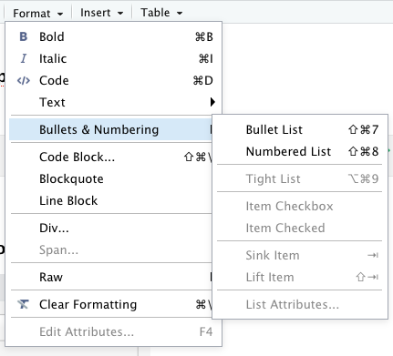
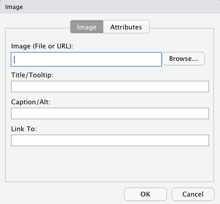
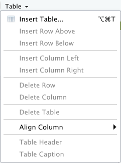

```{r setup, include=FALSE}
library(flexdashboard)
```

## Column {data-width="650"}

### Format text using the **Format** dropdown:

{width="400"}

## Column {data-width="350"}

### Insert **Images** using the Image dropdown:



### Edit tables using the **Table** dropdown:


